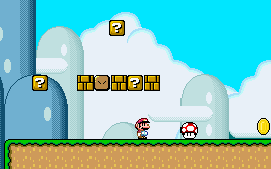

# Super Mario World - Godot edition

This is a college work of a Super Mario clone that implements a gamepad using the ESP32 microcontroller.

Made using **Godot 3.5.2**

[Here is a video](https://youtu.be/CCXh-xdAgdk) that shows the game and the ESP32 controller implementation

## Gallery

# License
Anyone is free to copy, modify, publish, use, compile, sell, or
distribute this software, either in source code form or as a compiled
binary, for any purpose, commercial or non-commercial, and by any
means.